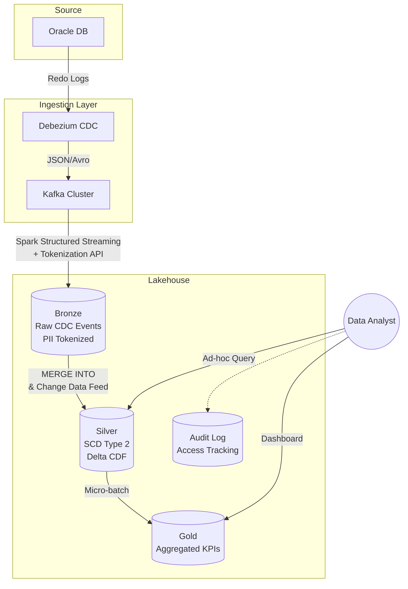

# Bonus Challenge: CDC từ ride-hailing Việt Nam → Lakehouse (Nghị định 13)

## 1. Problem Statement
Hệ thống cần xử lý luồng dữ liệu CDC từ hệ thống Oracle của một ứng dụng gọi xe tại Việt Nam, đạt 100 triệu chuyến/năm với peak load 30K writes/giây. 
Yêu cầu cốt lõi:
1. **Performance:** Dashboard của Data Analyst cần refresh dưới 60s kể từ source commit; các ad-hoc query phải trả về p95 < 1s.
2. **Data Privacy (Nghị định 13/2023/NĐ-CP):** Phải bảo vệ PII (CMND, SĐT, GPS) của tài xế và khách hàng. Phải có audit log cho mọi truy cập vào PII.
3. **Data Quality:** Xử lý triệt để late-arriving data (sự kiện đến muộn do tài xế mất mạng), đảm bảo không ghi đè dữ liệu mới bằng dữ liệu cũ một cách bất hợp lý.
Thách thức lớn nhất là cân bằng giữa real-time latency (< 60s) và các quy tắc tokenization mã hóa PII phức tạp trước khi hạ cánh xuống Lakehouse.

## 2. Architecture Diagram

## 3. Quyết định chính & Alternatives
1. **Table Format:** Chọn **Delta Lake**.
   - *Loại Apache Hudi:* Dù Hudi hỗ trợ upsert tốt, ecosystem của Delta (Delta CDF, integration tốt với Spark/Polars) phổ biến và dễ vận hành hơn tại Việt Nam.
   - *Loại Iceberg:* Delta có Change Data Feed (CDF) out-of-the-box xử lý CDC streaming mượt mà hơn.
2. **Ingestion Layer:** Chọn **Kafka + Spark Structured Streaming**.
   - *Loại AWS Kinesis:* Kinesis có chi phí đắt đỏ ở scale lớn và gây vendor lock-in.
   - *Loại Batch ELT (Airbyte/Fivetran):* Không đáp ứng được SLA dashboard refresh 60s.
3. **PII Handling:** Chọn **Tokenization ngay tại Ingestion (Spark) trước khi ghi vào Bronze**.
   - *Loại Mã hóa ở tầng Silver:* Raw PII sẽ tồn tại ở Bronze, vi phạm compliance của Nghị định 13 nếu lớp Bronze bị leak.
   - *Loại Dynamic Data Masking lúc query:* Rủi ro rò rỉ vẫn nằm ở storage layer dưới dạng plaintext.
4. **Late-Data Handling:** Chọn **Delta `MERGE INTO` kết hợp `src.ts > tgt.ts`**.
   - *Loại Overwrite partition:* Chi phí I/O khổng lồ và không khả thi với luồng streaming 30K writes/s.
5. **Data Catalog:** Chọn **Nessie**.
   - *Loại Hive Metastore:* Thiếu Git-like semantics (branching/tagging) để debug data.
   - *Loại Databricks Unity Catalog:* Để tránh vendor lock-in hoàn toàn và có thể host độc lập.

## 4. Failure Modes (Kịch bản sự cố)
1. **Kafka Lag đột biến (Đêm Giao thừa):** Lượng booking tăng vọt, Kafka consumer tụt lại, SLA > 60s. 
   - *Detect:* Cảnh báo Prometheus alert khi offset lag > 500K messages.
   - *Rollback/Fix:* Tự động scale-out Spark executors dựa trên metrics.
2. **Late data làm sai lệch logic Aggregation ở Gold:** Dữ liệu chuyến đi offline đồng bộ lên sau 2 ngày, làm sai dashboard doanh thu của 2 ngày trước.
   - *Detect:* Audit report hàng ngày đối chiếu lệch số giữa tổng Silver và Gold.
   - *Fix:* Kích hoạt Delta CDF đọc từ Silver để re-calculate (tính toán lại) riêng những phân vùng (partitions) bị ảnh hưởng ở Gold thay vì full-refresh tốn kém.
3. **Lọt PII plaintext vào Bronze:** Lỗi code ingestion khiến PII không bị tokenized.
   - *Detect:* Data Quality pipeline (Great Expectations) scan mẫu dữ liệu chặn lại và alert slack.
   - *Rollback:* Dùng Delta Time Travel `RESTORE TO VERSION AS OF` trước khi deploy mã lỗi, fix code và chạy lại luồng streaming từ Kafka offset tương ứng.

## 5. Ước lượng chi phí (Back-of-envelope)
- **Data size:** 100M trips/năm × 2KB/trip = ~200 GB raw. + CDC updates/metadata ~ 1 TB/năm.
- **Storage:** Amazon S3 Standard (1 TB) = ~$23/tháng.
- **Compute (Kafka + Spark):** 
  - MSK (Kafka) 3 brokers m5.large = ~$300/tháng.
  - EMR Serverless (Spark Streaming) = ~200 vCPU-hours/ngày × 30 = ~$300/tháng.
- **Tổng cộng:** ~$650/tháng (Rất an toàn trong ngân sách tiêu chuẩn cho quy mô dữ liệu doanh nghiệp).

## 6. Build MVP 1 Tuần
**Slice cần build đầu tiên:** End-to-end CDC cho 1 bảng `trips` giả lập từ PostgreSQL (thay cho Oracle) -> Debezium -> Kafka -> Delta Bronze. 
*Mục tiêu chứng minh:*
- Khi update một chuyến xe ở DB, bản ghi mới hiện ở Delta Bronze trong vòng < 60s.
- Một cột giả lập SĐT đã bị token hóa (mã hóa) thành công khi nằm trên S3.
